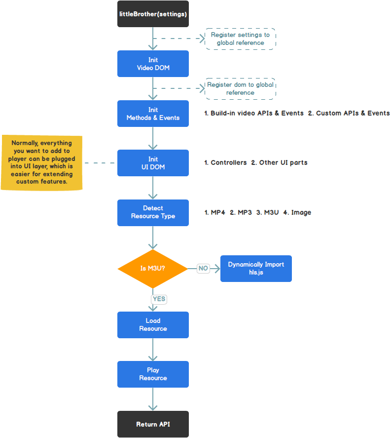

<h1>little-brother-player</h1>

## Introduction

小老弟H5多媒体播放器。

> Little brother player, which is in progress, is a video player based on HTML5 and coded with ES2015.
> The detailed documents will be produced in the nearly future once the primary features have been fulfilled. If there's anything else you might want to know, please feel free to contact me at serdeemail@gmail.com either in English or Mandarin.

## Features in the near future

- [x] Playing mp3
- [x] Playing mp4
- [x] Playing m3u
- [x] Displaying poster
- [ ] Advertisement
- [ ] Statistics
- [x] Live comments (AKA 弹幕)
- [ ] Share
- [ ] Text tracks
- [ ] ...(TBD)

## Design Principle

### Lifecycle Diagram

